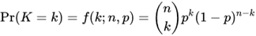

# 이항분포

##  베르누이 확률변수

가장 간단한 형태의 이산확률변수(discrete random variable)는 결괏값이 2가지입니다. 앞면 혹은 뒷면의 결괏값을 가지는 동전 뒤집기의 경우가 가장 대표적인 예입니다. 이런 간단한 확률변수를 **베르누이 확률변수(Bernoulli random variables)**라고 합니다. 또한 오직 2가지 결괏값이 나오는 시행을 **베르누이 시행(Bernoulli trial)**이라고 합니다.

E(X) = (0 \times P(X=0)) + (1 \times P(X=1)) = (0 \times (1-p)) + (1 \times p) = p

E(X^2) = (0^2 * P(X=0)) + (1^2 * P(X=1)) = p

Var(X) = E(X^2) - (E(X))^2 = p - p^2 = p(1-p)

## 이항분포

이항 분포는 연속된 n번의 독립적 시행에서 각 시행이 확률 p를 가질 때의 이산 확률 분포이다.

 

--------------------------

*참고자료*

* *Anthony Hayter, 『Probability and Statistics for Engineers and Scientists』, BROOKS/COLE, p147~150*.
